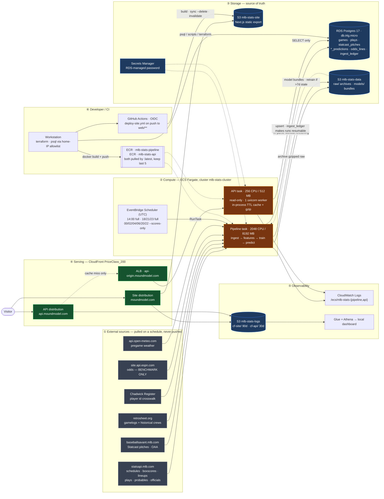

# MLB Stats Project

Predicts MLB **winning margins**, **per-batter performance vs. the probable
starting pitcher**, and **game run totals**, trained on the 2022–2025 seasons
with walk-forward validation. Cloud-native successor to the NBA Stats Project.

Live at **[moundmodel.com](https://moundmodel.com)** (EN/JA), API at
`api.moundmodel.com`.

**Start here: [docs/PROJECT_PLAN.md](docs/PROJECT_PLAN.md)** — goals,
architecture, modeling design, and the phase roadmap.

## Architecture

Everything runs in `us-east-1`. Two Fargate workloads share one Postgres and one
S3 bucket: a **scheduled pipeline task** that ingests, builds features, trains and
predicts, and an **always-on API task** that only ever reads. Both are behind
CloudFront on `PriceClass_200`, so Asian edges serve the bilingual site.



### A day in the life

The write path and the read path only ever meet at Postgres. Nothing a visitor
does can trigger a model run, and the pipeline never calls the API.

```mermaid
sequenceDiagram
    autonumber
    participant EB as EventBridge<br/>Scheduler
    participant P as Fargate pipeline<br/>2048/8192
    participant X as External APIs
    participant S3 as S3 data bucket
    participant DB as RDS Postgres
    participant U as Visitor (Tokyo)
    participant CF as CloudFront<br/>Tokyo edge
    participant A as Fargate API<br/>256/512

    rect rgb(40, 40, 60)
        Note over EB,DB: 14:00 UTC — full run (orchestration.daily, no override)
        EB->>P: RunTask (image from ECR :latest)
        P->>DB: probe officials (best-effort, before any heavy work)
        P->>X: StatsAPI feeds + Statcast day CSVs (last 10 days)
        X-->>P: GUMBO feeds, pitch-level rows
        P->>S3: archive gzipped raw → raw/
        P->>DB: upsert rows, mark ingest_ledger imported
        P->>DB: rebuild park_factors
        P->>X: today's slate — probables + posted lineups
        P->>X: ESPN odds (today open, yesterday close) · Open-Meteo weather
        P->>DB: odds_lines — benchmark only, never a feature
        Note right of P: weather is held in memory only,<br/>never persisted
        P->>S3: load models/*.joblib
        alt bundle missing or older than 7 days
            P->>DB: team_rating.refresh() → team_strength_pregame
            P->>P: retrain team + per-PA batter models
            P->>S3: write refreshed bundles
        end
        P->>P: build features in memory (the daily path<br/>does not write feature_snapshots)
        P->>DB: upsert model_predictions, batter_predictions,<br/>pitcher_predictions — model_version daily_v1
    end

    rect rgb(40, 55, 45)
        Note over EB,DB: 18/21/23 UTC — the same full run, three more times
        EB->>P: RunTask (no command override)
        P->>X: posted lineups + late probables now available
        P->>DB: predictions upsert in place over the morning run
    end

    rect rgb(55, 45, 40)
        Note over EB,DB: 00/02/04/06/20/22 UTC — scores only
        EB->>P: RunTask --scores-only
        P->>X: yesterday + today, finals
        Note right of P: Statcast deliberately not seeded —<br/>a partial day must never enter the ledger
        P->>DB: import finals → picks grade the same evening
    end

    rect rgb(35, 50, 60)
        Note over U,DB: Any time — a page view
        U->>CF: GET moundmodel.com (static export)
        CF-->>U: HTML + JS from the Tokyo edge
        U->>CF: XHR /api/public/{summary,feed,results,batter-results}
        alt edge cache HIT
            CF-->>U: gzipped JSON, ~0.03 s
        else edge cache MISS
            CF->>A: via ALB at api-origin.moundmodel.com
            alt in-process cache fresh
                A-->>CF: ~0.003 s
            else stale
                A-->>CF: serve stale now
                A->>DB: background refresh
            else cold
                A->>DB: single-flight, date-bounded SELECT
                DB-->>A: bounded rows
            end
            A-->>CF: gzip + Cache-Control: max-age=60
            CF-->>U: cached at the edge for the next viewer
        end
    end
```



For how the serving path got this shape — the diagnosis, the measurements, and
what is still outstanding — see
**[docs/api_performance_playbook.md](docs/api_performance_playbook.md)**.

## Setup

```powershell
# 1. Python environment
python -m venv .venv
.venv\Scripts\pip install -r requirements.txt

# 2. AWS infrastructure (RDS Postgres, S3, Secrets Manager)
cd infra
Copy-Item terraform.tfvars.example terraform.tfvars   # set your home IP
terraform init; terraform apply

# 3. Local config
Copy-Item .env.example .env    # fill from `terraform output` in infra/

# 4. Database schema
.venv\Scripts\python scripts\migrate.py
```

## Layout

| Path | Purpose |
|---|---|
| `core/` | Shared library: DB engine, feature selection (single source of truth), feature store IO, model registry, S3 artifact store |
| `ingestion/` | StatsAPI / Statcast / odds ingest (Phase 1) |
| `features/` | Feature builders: team, batter, park factors, team rating (Phase 2) |
| `modeling/` | Training, prediction, calibration (Phase 3+) |
| `validation/` | Walk-forward runner, noise-aware ablation harness, benchmarks (Phase 3) |
| `orchestration/` | `daily.py` — the scheduled end-to-end run (Phase 5) |
| `api/` | Read-only FastAPI service + its in-process cache (Phase 6) |
| `web/` | Next.js static export, bilingual EN/JA |
| `experiments/` | Numbered, one file per hypothesis; results logged in `docs/model_tuning_log.md` |
| `migrations/` | Ordered SQL migrations, applied by `scripts/migrate.py` |
| `infra/` | Terraform for AWS (VPC, RDS, S3, ECS, CloudFront) |
| `docs/` | Project plan, schema doc, experiment journal, performance playbook |

## Conventions (hard-won in the NBA project)

- **Feature selection has exactly one home**: `core/features.py::select_features()`.
- **Point-in-time only**: every feature is stamped with `data_through_date`;
  postgame information never enters a pregame feature.
- **No data files in the repo** — DB and S3 are the source of truth.
- **Odds are a benchmark, never a feature.**
- **The API is read-only and model-free** — no torch/lightgbm in that image.
- Every model/feature change gets a `docs/model_tuning_log.md` entry with a
  walk-forward result and a significance test.
