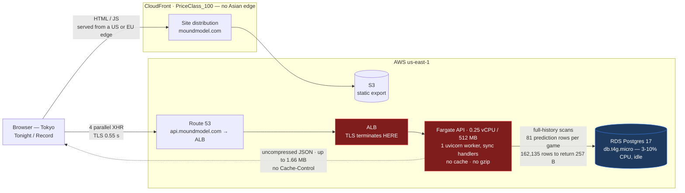
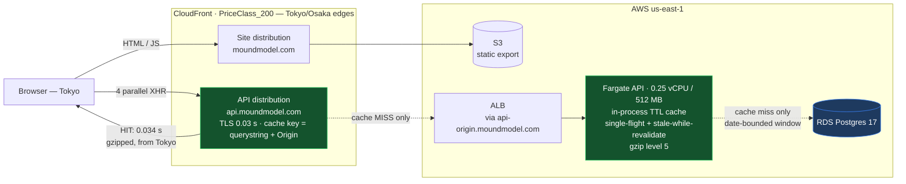
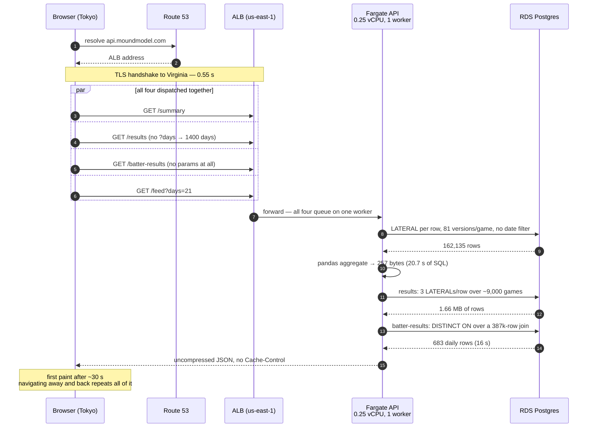
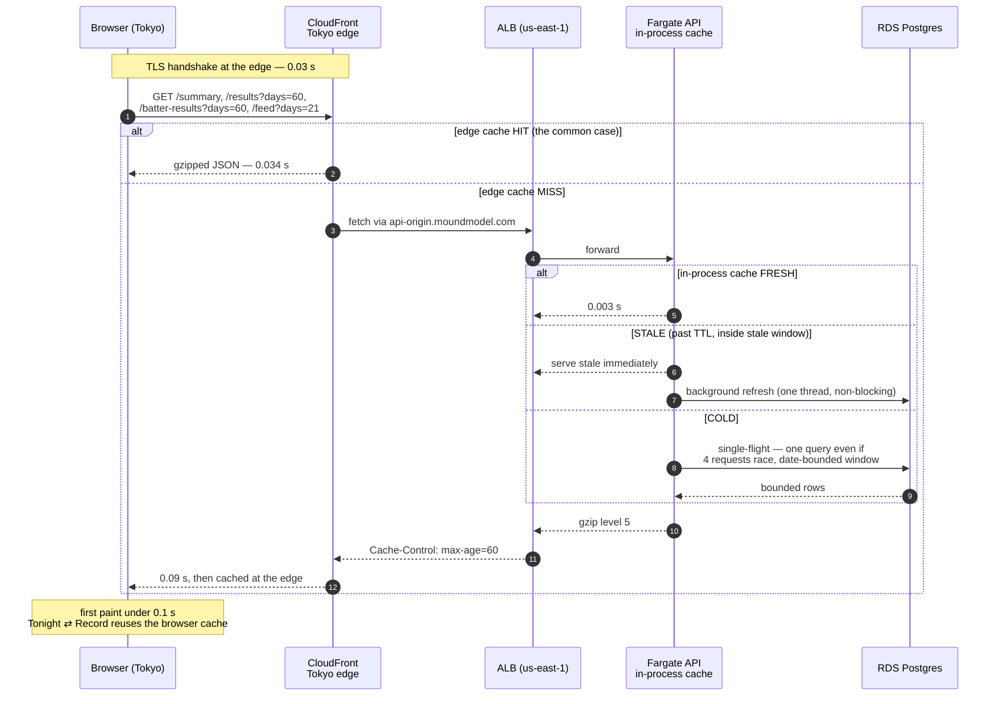

# API performance playbook — diagnosing and fixing slow read pages

**Case study: moundmodel.com "Tonight" and "Record", 2026-08-07.**

Written to be portable. The architecture it assumes is the one shared by this
project and the NBA Stats Project: a **static frontend** (Next.js `output:
"export"` on S3+CloudFront) that fetches everything **client-side** from a
**FastAPI + SQLAlchemy Core + Postgres** service on **Fargate behind an ALB**.
If your stack matches, the commands below run as-is with names substituted.
If it doesn't, Part 1's *reasoning* still applies — only the commands change.

Contents:

0. [Before and after, in pictures](#before-and-after-in-pictures)
1. [Diagnosis: the logic, the commands, and a lab you can run](#part-1--diagnosis)
2. [The full menu of fixes, tiered](#part-2--the-menu-of-fixes)
3. [What was actually implemented, and what it bought](#part-3--implementation)
4. [Porting this to another project](#part-4--porting-checklist)

---

## The one-paragraph version

Two pages took 5–10+ seconds to show anything. The cause was not the database
— RDS sat at 3–10% CPU with full burst credits. It was that **every page view
recomputed the entire graded history from base tables**, on a 0.25 vCPU
container, with **no caching at any layer and no compression**. One endpoint
pulled 162,135 rows out of Postgres into pandas to return **257 bytes**, and
took 30 seconds doing it. The fix was three cheap changes — an in-process
cache with stale-while-revalidate, fetching only the window being rendered,
and gzip — which took a cold worst-case page load to 2.3s and a normal one to
0.13s of server time. A second pass put CloudFront in front of the API, which
took the remaining cost — a 0.55s TLS handshake from Tokyo to us-east-1 — down
to 0.03s.

---

## Before and after, in pictures

### Architecture — before

Every layer that could have absorbed a read was missing one. CloudFront existed
but only in front of the static site; the API was Route 53 straight to an ALB,
so every viewer terminated TLS in Virginia and every request reached Postgres.



### Architecture — after



### Sequence — before

The Record page fired four requests at once into a single uvicorn worker on a
quarter of a CPU, so they queued behind each other as well as being slow
individually.



### Sequence — after

Three caches now sit in front of Postgres, and each one absorbs the request
class the one behind it would have handled.



---

## Part 1 — Diagnosis

### The reasoning chain

The temptation with a slow page is to guess at a cause and start optimizing.
Don't. Work outside-in, and let each measurement tell you which layer to open
next. The order matters because each step is cheaper than the one after it,
and because **most performance work is wasted on the wrong layer** — the
single most common failure here would have been upsizing the database, which
the metrics prove is idle.

**Step 1 — Measure from outside, per endpoint. Separate latency from bytes.**

The first fork in the road is whether you are waiting on *the server thinking*
or on *data moving*. `curl -w` answers this in one call. The number that
matters is **TTFB (`time_starttransfer`)** versus **`time_total` minus TTFB**:

- High TTFB, small response → the server is computing. Look at queries.
- Low TTFB, long tail → the response is too big or uncompressed. Look at bytes.
- High `time_appconnect` → TLS handshake cost; implicates missing CDN/geography.

A tiny response with an enormous TTFB is the loudest possible signal: **the
work is not proportional to the output.** That's the fingerprint of an
aggregate computed at request time over data that should have been reduced
ahead of it.

**Step 2 — Map which page calls which endpoint, and whether it waterfalls.**

Read the page components. You need three facts per page: which endpoints fire,
whether they're parallel or sequential, and what parameters they send. Watch
especially for *default* parameters — a client that omits `?days=` inherits
whatever the server's default is, and server defaults get set to "everything"
early in a project and never revisited.

**Step 3 — Check the cheap layers before the expensive ones.** In order:

1. Are `Cache-Control`/`ETag` set? (Free. Nothing else matters if every
   navigation refetches from zero.)
2. Is the response compressed? (One line of middleware.)
3. Is there an application-level cache? (Hours of work.)
4. Are the queries themselves sane? (Days of work.)
5. Is the infrastructure undersized? (Costs money forever — check it *last*,
   because steps 1–4 usually make it unnecessary.)

**Step 4 — Rule out the database explicitly.** This is the step people skip.
Pull RDS CPU, burst-credit balance, and read latency from CloudWatch. If the
DB is idle, every hour spent on indexes and instance classes is wasted. An
idle DB paired with a slow endpoint means the time is going to *the
application*: row transfer, deserialization, and in-process computation.

**Step 5 — Confirm what the constraint actually is.** Pull ECS CPU for the API
service. Note that CloudWatch averages over the sampling period, so a task
that pegs its CPU for 30 seconds of a 60-second window reports ~50%, not 100%.
Read the *Maximum* statistic, and read it as a floor.

**Step 6 — Size the data, and look for redundancy ratios.** Count rows in the
serving tables — but more importantly, compute **rows per logical entity**:

```sql
SELECT round(avg(n),1) FROM (SELECT count(*) n FROM predictions GROUP BY game_id) s;
```

This project stores predictions append-only, one row per model version per
`data_through_date`. That's correct for auditing and point-in-time work. But
it means **81.4 prediction rows per game** — and every read query resolved
"which one is current" with a `JOIN LATERAL ... ORDER BY created_at DESC LIMIT
1` **per row, at request time**. A query that looks like it touches 9,000
games actually sorts 81 rows for each of them, with no index supporting the
sort. This ratio is the single most useful number in the whole investigation
and it is invisible unless you go looking for it.

**Step 7 — Time the SQL server-side, separately from the endpoint.** Run the
exact query text through the same engine the API uses. This splits *query
time* from *framework + serialization + pandas* time and tells you whether to
fix SQL or fix Python.

### The lab

Run these in order against your own service. Substitute `API`, the DB
identifier, and the ECS cluster/service names. Bash syntax (Git Bash on
Windows); PowerShell equivalents noted where they differ.

#### 1. Enumerate endpoints and time every one

```bash
API=https://api.moundmodel.com

# What endpoints exist?
curl -s $API/openapi.json | python -c "import sys,json; [print(p) for p in json.load(sys.stdin)['paths']]"

# Time each one: TTFB vs total vs bytes.
for p in /api/public/summary /api/public/results /api/public/feed; do
  curl -s -o /dev/null \
    -w "$p -> ttfb=%{time_starttransfer} total=%{time_total} size=%{size_download} code=%{http_code}\n" \
    "$API$p"
done
```

Full timing breakdown for a single suspect endpoint:

```bash
curl -s -o /dev/null -w "dns=%{time_namelookup} conn=%{time_connect} tls=%{time_appconnect} ttfb=%{time_starttransfer} total=%{time_total} size=%{size_download}\n" "$API/api/public/summary"
```

> **What we saw.** `/api/public/summary`: `ttfb=30.14s size=257`. A 257-byte
> response that takes half a minute. `/api/public/results`: `size=1660778` —
> 1.66 MB. `tls=0.61` on every cold connection, because the API has no CDN and
> the viewer was in Japan hitting us-east-1 directly.

#### 2. Check compression and cache headers

```bash
# If content-length is identical with and without Accept-Encoding, there is no
# compression middleware. Look for: content-encoding, vary, cache-control.
curl -s -D - -o /dev/null -H "Accept-Encoding: gzip, br" "$API/api/public/results" | \
  grep -iE "content-encoding|content-length|cache-control|etag|vary"
```

> **What we saw.** No `content-encoding`, no `cache-control`, no `etag`. The
> 1.66 MB went over the wire raw, on every page view, to every visitor.

#### 3. Test whether parameters actually do anything

A parameter the server ignores is worse than a missing one — it looks like a
control and isn't.

```bash
for d in 7 60 1400; do
  curl -s -o /dev/null -w "days=$d ttfb=%{time_starttransfer} size=%{size_download}\n" \
    "$API/api/public/results?days=$d"
done
```

> **What we saw.** `results` scaled with `days` (correct). `batter-results`
> returned byte-identical responses in ~16s for `days=7` and `days=60` — the
> endpoint declared no `days` parameter at all, so FastAPI silently dropped it
> and always scanned all history.

#### 4. Rule out the database

```bash
aws rds describe-db-instances \
  --query "DBInstances[].{id:DBInstanceIdentifier,class:DBInstanceClass,storage:AllocatedStorage}" \
  --output json

END=$(python -c "import datetime;print(datetime.datetime.now(datetime.UTC).strftime('%Y-%m-%dT%H:%M:%SZ'))")
START=$(python -c "import datetime;print((datetime.datetime.now(datetime.UTC)-datetime.timedelta(hours=6)).strftime('%Y-%m-%dT%H:%M:%SZ'))")

for M in CPUUtilization CPUCreditBalance FreeableMemory ReadLatency; do
  echo "--- $M ---"
  aws cloudwatch get-metric-statistics --namespace AWS/RDS --metric-name $M \
    --dimensions Name=DBInstanceIdentifier,Value=mlb-stats-db \
    --start-time $START --end-time $END --period 900 --statistics Average Maximum \
    --query "sort_by(Datapoints,&Timestamp)[-8:].[Timestamp,Average,Maximum]" --output text
done
```

Read it like this: **CPU under ~20% with a full `CPUCreditBalance` and
sub-millisecond `ReadLatency` means the database is not your problem.** On
burstable classes (`t3`/`t4g`), a *draining* credit balance is the thing to
fear — it throttles you hard and produces exactly the erratic latency people
misdiagnose as query cost.

> **What we saw.** 3–10% CPU, credits pinned at the 288 maximum, read latency
> ~0.0005s. Idle. The DB was exonerated in one command, which redirected the
> entire investigation to the application container.

#### 5. Confirm the container is the constraint

```bash
CLUSTER=$(aws ecs list-clusters --query "clusterArns[]" --output text | tr '\t' '\n' | grep -i mlb | head -1 | sed 's|.*/||')

for M in CPUUtilization MemoryUtilization; do
  aws cloudwatch get-metric-statistics --namespace AWS/ECS --metric-name $M \
    --dimensions Name=ClusterName,Value=$CLUSTER Name=ServiceName,Value=mlb-stats-api \
    --start-time $START --end-time $END --period 300 --statistics Average Maximum \
    --query "sort_by(Datapoints,&Timestamp)[-10:].[Timestamp,Average,Maximum]" --output text
done
```

Also read the Terraform: task `cpu`/`memory`, `desired_count`, whether any
`aws_appautoscaling_target` exists, and whether the container runs
`uvicorn --workers N` or a single process.

> **What we saw.** 256 CPU / 512 MB, `desired_count = 1`, no autoscaling,
> single uvicorn worker, all handlers sync `def` (so FastAPI runs them in a
> bounded threadpool). Max CPU ~44% on 5-minute sampling during a burst —
> which, given averaging, means it was pegging 0.25 vCPU.

#### 6. Size the data and find the redundancy ratio

```python
# scratch script, run with the project venv and PYTHONPATH=<repo root>
import time
from sqlalchemy import text
from core.db import get_engine

eng = get_engine()
qs = {
    "games_final":        "SELECT count(*) FROM games WHERE is_final",
    "model_predictions":  "SELECT count(*) FROM model_predictions",
    "batter_predictions": "SELECT count(*) FROM batter_predictions",
    # The ratio that explains everything:
    "mp rows/game":       "SELECT round(avg(n),1) FROM (SELECT count(*) n FROM model_predictions GROUP BY game_pk) s",
    "bp rows/batter-game":"SELECT round(avg(n),1) FROM (SELECT count(*) n FROM batter_predictions GROUP BY game_pk, player_id) s",
}
with eng.connect() as c:
    for k, q in qs.items():
        t = time.perf_counter()
        print(f"{k:24s} {c.execute(text(q)).scalar():>12}   ({time.perf_counter()-t:.2f}s)")
```

Run it:

```bash
PYTHONPATH="$(pwd)" .venv/Scripts/python /path/to/scratch.py
```

> **What we saw.** 17,500 final games but **732,361** `model_predictions`
> (81.4/game) and **902,659** `batter_predictions` (5.5/batter-game). The
> tables are append-only across 690 distinct `data_through_date`s.

#### 7. Time the real SQL server-side

Copy the exact `text(...)` block out of the handler and run it standalone with
`time.perf_counter()` around `fetchall()`. Compare that to the endpoint's TTFB:
the gap is framework, pandas, and serialization.

> **What we saw.** The summary endpoint's batter query returned **162,135 rows
> in 20.7s**; its game query returned 8,996 rows in 5.6s. Roughly 26s of the
> 30s TTFB was SQL. That said the fix belonged in *what we ask for*, not in
> pandas.

### Diagnosis summary

| Endpoint | TTFB | Payload | Actually returns |
|---|---|---|---|
| `/api/public/summary` | **28–30 s** | 257 B | ~6 headline numbers |
| `/api/public/batter-results` | **16 s** | 89 KB | 1,462 daily rows |
| `/api/public/results` (default 1400 d) | 4–7 s | **1.66 MB** | ~9,000 game rows |
| `/api/public/feed?days=30` | 2.5 s | 74 KB | slate + recent days |

Tonight fired three of these in parallel; Record fired all four — at one
uvicorn process on 0.25 vCPU, so they queued behind each other.

**Four independent root causes, none of them the database:**

1. **Read-time resolution of append-only versions.** `LATERAL ... ORDER BY
   created_at DESC LIMIT 1` per row, with 81 candidate rows per game and no
   supporting index.
2. **Unbounded aggregates.** Three endpoints had no date filter at all; the
   work grew with total history, forever, regardless of what was displayed.
3. **No cache at any layer** — no CDN on the API, no HTTP headers, no
   in-process memoization, no rollup tables.
4. **No compression**, and clients defaulting to `days=1400` to render 30 days.

---

## Part 2 — The menu of fixes

Presented as offered, so the reasoning survives for the next project.

### System design

1. **Precompute the grading; don't recompute per request.** Rollup tables
   (`pred_grades` per game, `batter_grades_daily` per day) refreshed by the
   pipeline that already runs when the data changes. Endpoints collapse to
   index scans over pre-resolved rows: ~30s → under 200ms. *This is the real
   fix; everything else is mitigation.*
2. **Or skip the API entirely for historical data.** The site is already a
   static export behind CloudFront — have the pipeline write `summary.json`,
   `results.json` into the site bucket. No API, no DB, edge-cached globally.
   Cheaper and faster than (1) for pages that only read frozen history.
3. **TTL-cache the endpoints, with single-flight.** Cheapest large win.
   Band-aid over (1), not a substitute.
4. **Fetch the window you render.** Clients requested 1400 days to draw 30.
   Push date filters into SQL where an index can use them.
5. **Split "today" out of the historical feed.** Tonight's 15 games arrived
   inside a 30-day payload that also dragged every batter prediction in the
   window.

### Infrastructure

6. **Put CloudFront in front of the API.** Edge caching, free brotli/gzip, TLS
   terminated near the viewer instead of a 0.6s handshake to Virginia.
7. **Check the CloudFront price class.** `PriceClass_100` is US/Canada/Europe
   only. A bilingual EN/JA site serving Japanese readers from a US edge is
   paying ~200ms RTT for nothing; `PriceClass_200` adds Tokyo/Osaka.
8. **Add GZip middleware.** One line; ~85% off numeric JSON.
9. **Right-size the task.** 0.25 vCPU running pandas over 162k-row frames is
   the direct cause of the 30s. 512 MB is also an OOM risk on those frames.
10. **Add the missing indexes** for the read patterns you actually have:
    `(game_pk, model_type, created_at DESC)`, `(game_pk, player_id, created_at
    DESC)`, `odds_lines (game_pk, is_closing, captured_at DESC)`, partial
    `games (game_date) WHERE is_final`.
11. **Add guardrails**: `statement_timeout` and `connect_timeout`. With
    `pool_size=5` on one process, a few slow queries starve the service.

**Sequencing offered:** 3, 4, 8 first (an afternoon, no infra change), then
1 or 2 to remove the cold-miss cliff permanently, then 6 for global speed.

---

## Part 3 — Implementation

What shipped in this pass: **3 (TTL cache), 4 (window-scoped fetching), 8
(gzip)**, plus response cache headers as the natural companion to 3.

### System design changes

**`api/cache.py` (new) — in-process TTL cache with single-flight and
stale-while-revalidate.** Stdlib only; no Redis, no new dependency.

Three properties, each earning its complexity:

- **TTL.** Everything served is regenerated by the pipeline on a schedule, so
  a few-minute-old answer is always safe. `FEED_TTL = 300s` (slate and scores
  move most), `RECORD_TTL = 1800s` (graded history moves only when finals
  land).
- **Single-flight.** The Record page fires four requests at once. Without a
  per-key lock, a cold cache means four concurrent full-history scans on one
  0.25 vCPU process, each slowing the others. Verified: 8 concurrent cold
  callers → exactly 1 execution.
- **Stale-while-revalidate.** *A plain TTL just moves the 30-second wait onto
  whoever arrives first after expiry.* Serving the stale value while one
  background thread refreshes means only a genuinely cold process ever blocks.

Plus the details that keep it safe in production: entries are **bounded**
(`MAX_ENTRIES = 64`, because `days` is caller-controlled up to 2000 and each
entry can hold megabytes on a 512 MiB container); **exceptions are never
cached**; a failed background refresh **keeps serving the old value** and
backs off for 30s instead of spawning a thread per request.

**`lifespan` warm-up in `api/main.py`.** The cache is process-local, so a
deploy starts cold. A background thread primes exactly what the two default
page loads request. Best-effort and non-blocking — it must never delay the ALB
health check.

**Window-scoped fetching (`web/app/page.tsx`, `web/app/record/page.tsx`).**
Both pages now request the span they are about to draw:

- Tonight: `results?days=daysBack(win)`, and the feed starts at **7 days**,
  widening only when the reader clicks "show more" — it renders 4 days at a
  time but was fetching 30.
- Record: default window **3m → 2m**, and the window selector now *drives the
  request* instead of filtering an already-downloaded archive.
- Both use a `live` flag so a slow wide window can't land after the reader has
  switched to a narrow one. Every number on the Record page is labelled with
  its window; showing one window's rows under another's heading would be a lie.

**Server-side date filters.** `/api/public/batter-results` gained a real
`days` parameter, pushed into the innermost join where `idx_games_date` can
use it — the endpoint previously accepted no parameters and always scanned all
history. `/api/public/results`' default dropped from **1400 → 120** days.

> Correctness note: `hr_rank` is ranked *within* a `game_date`, so narrowing
> the window drops whole days rather than reshuffling the ones that remain —
> the retained days are bit-identical. This was verified, not assumed.

### Infrastructure changes

**GZip** (`GZipMiddleware(minimum_size=1000, compresslevel=5)`). Level 5 not
the default 9: on 0.25 vCPU the CPU cost of level 9 is a bad trade for a
marginal size gain. Measured: 141,743 B → 22,495 B (**84% smaller**).

**Middleware order matters.** Starlette's `add_middleware` inserts at the
front, so **the last one added is the outermost**. GZip is added *before*
CORS, so CORS ends up outside it and its headers survive on compressed and
error responses alike. Verified by introspecting `app.user_middleware`:

```
BaseHTTPMiddleware (cache headers)  <- outermost
CORSMiddleware
GZipMiddleware                      <- innermost
```

**`Cache-Control` on `/api/public/*`**: `public, max-age=60,
stale-while-revalidate=600`. This is what makes a Tonight → Record navigation
free instead of a second full refetch, and it is exactly what a CloudFront
distribution would need if item 6 ships later. Deliberately *shorter* than the
server TTLs — the browser cache is the one you can't flush.

No Terraform changed *in this pass*. CloudFront and the DB timeout guardrails
shipped later (below); task sizing and the read-path indexes were declined —
see the closing section for why.

**Timeout guardrails** (item 11), added once the queries were fast enough that
a slow one meant something was wrong. Two lessons generalise:

*The default is the dangerous part.* One `get_engine()` serves a read-only API
and a batch pipeline whose tolerable query lengths differ by three orders of
magnitude. A `statement_timeout` that looked sensible for the API would kill a
feature build mid-run. So `connect_timeout` is always on (a hung connect should
never hold a pool slot), and `statement_timeout` is **opt-in via an env var**,
set only on the API task. `scripts/test_db_guardrails.py` asserts *both*
directions — that the ceiling fires when set, and that nothing is imposed when
it isn't, because the silent-breakage direction is the one a smoke test misses.

*Pick the value from a boundary that already exists, not a round number.* The
API's ceiling is 30s because that is CloudFront's `origin_read_timeout`: past
it, the database would be burning a pool slot producing a response the CDN has
already stopped waiting for. Measure the slowest legitimate statement first —
here 2.6s, `/api/performance` at its 365-day max, which fetches ~124k
un-deduplicated prediction rows — so you know the ceiling clips nothing real.

### Verification

Correctness first — **all outputs byte-identical to production** for the same
windows (`batter-results` 683/683 rows, `results` at 30 and 60 days, `summary`,
`feed`). The cache and the date filters changed no numbers.

`scripts/test_api_cache.py` (new, no DB required) covers the threading
behaviour a smoke test can't reach:

```powershell
.venv\Scripts\python scripts\test_api_cache.py
```

> memoizes per key · 8 concurrent cold callers → 1 execution · stale request
> returns in 0.000s with the old value · background refresh replaces it ·
> errors retry · entries stay ≤ 64.

**Results** (server-side; excludes WAN, which is unchanged until a CDN lands):

| Measurement | Before | After |
|---|---|---|
| `/api/public/summary` | 28–30 s | **0.003 s** |
| `/api/public/batter-results` | 16 s | **0.004 s** (901 B gzipped) |
| `/api/public/results` | 4–7 s, 1.66 MB | **0.018 s**, 22 KB gzipped |
| Record page, all 4 calls, **cold cache** | ~30 s | **2.30 s** |
| Record page, all 4 calls, warm | ~30 s | **0.13 s** |
| `batter-results` on an uncached window | 16 s | 1.46 s |

The cold-cache row is the honest worst case: a window nobody has requested
within the TTL. The 30s cliff is gone even there, because the query is now
bounded by a date filter.

### Second pass: CloudFront on the API (items 6 and 7)

Shipped immediately after, in `infra/api_cdn.tf`. Three things are worth
carrying to another project:

**The origin needs its own hostname.** CloudFront validates the origin's
certificate against the *origin domain name*, so it cannot use the ALB's
`*.elb.amazonaws.com` name (the cert covers your domain, not Amazon's) and it
cannot use `api.<domain>` either — that becomes the distribution's own alias,
which loops. The fix is a dedicated `api-origin.<domain>` with its own
certificate, attached to the existing HTTPS listener as an extra SNI cert.
Resist the tempting shortcut of adding a SAN to the main site certificate: that
forces a cert *replacement* and churns the live site distribution and ALB
listener for no benefit.

That origin hostname is initially reachable directly, which is convenient for
telling a CDN problem from an origin problem — but treat it as temporary. It
is published in Certificate Transparency logs the moment ACM issues the cert,
so it is enumerable by anyone, and it is a documented route around your own
cache. See the lockdown note below.

**Put `Origin` in the cache key whenever CORS is not `*`.** If the API echoes
the caller's origin into `access-control-allow-origin` (apex + www rather than
a wildcard), a shared cache that ignores the header will eventually hand a
`www` visitor a response permitting only the apex, and the browser rejects it.
Query strings matter for the same reason: the managed `CachingOptimized` policy
*strips* them, which would collapse every `?days=` variant into one response.
Both need a custom cache policy. Verify by requesting the same path from two
origins twice and diffing the returned header.

**Check the price class against where your readers are.** `PriceClass_100` is
US/Mexico/Canada and Europe/Israel/Türkiye *only* — it does **not** include
Japan, despite several AWS-hosted summaries and the CDK enum docs saying
otherwise. `PriceClass_200` is the cheapest class with Tokyo/Osaka. Japan
carries a ~34% per-GB premium ($0.114 vs $0.085), but CloudFront's always-free
tier is 1 TB and 10M requests per month, permanent and region-independent, so
below that scale the class change is free. ALB → CloudFront origin fetches are
also free.

Measured from Tokyo, `api.moundmodel.com`:

| Measurement | ALB direct | Via CloudFront |
|---|---|---|
| TLS handshake | 0.556 s | **0.029 s** |
| TTFB, cache hit | 0.74 s | **0.034 s** |

The same change on the *site* distribution (static HTML/JS, `PriceClass_100` →
`_200`) took its TTFB from 0.83 s to 0.072 s on edge hits — worth checking
before assuming the API was the slow part.

### Third pass: the rollup tables (item 1 — the actual fix)

`migrations/0015_grade_rollups.sql` adds `pred_grades` (one row per graded
game) and `batter_grades_daily` (one row per day).
`orchestration/grades.py` resolves the append-only prediction rows **once, on
write**, in the pipeline that already runs whenever the inputs change; the API
does an indexed range scan.

Server-side query time, measured with `EXPLAIN ANALYZE` on the same instance:

| Query | Before | After |
|---|---|---|
| summary — batter half | 5,707 ms | **0.1 ms** |
| batter-results, full history | 10,029 ms | **1.9 ms** |
| summary — games half | 102 ms | **2.8 ms** |
| results, 60 days | 11 ms | **1.6 ms** |

Four things worth stealing:

**Snapshot the old outputs before you touch the read path.** Freeze every
endpoint × window to JSON, then diff the rewrite against it. This is what
caught both real bugs, neither of which would have shown up in a smoke test.

**Bug 1 — storing a computed float in the source column's type.**
`market_p_home` is the no-vig conversion of two moneylines, computed in
float64. Stored as `REAL` (matching the moneyline columns it came from), it
silently became `0.6219831` instead of `0.6219831346321605`. Copied columns
may keep the source type; **computed** columns need the type of the
computation. Fixed in `0016`.

**Bug 2 — inheriting an unstable sort.** The old query was `ORDER BY
game_date`, which never defined order *within* a date, so its row order was
never reproducible. The rollup's scan produced a different tie order and the
diff lit up. The fix is to add the real tiebreaker (`, game_pk`) and compare
order-insensitively; verify no consumer depends on order first (the charts
either sort explicitly or aggregate).

**One accepted difference.** `avg_score_error` moved from 3.479316169348683 to
3.4793161687572205 — 6e-10, because pandas averaged a float32 column while
Postgres now averages in float64. The new value is the more accurate one and
the site renders `.toFixed(1)`. Everything else is identical; don't claim
"byte-identical" when it isn't.

**Keep the derived tables honest.** `scripts/test_grade_rollups.py` recomputes
the grading from base tables the long way and diffs it against the rollup, and
checks that an incremental refresh reproduces a full rebuild — so the numbers
can't depend on when the pipeline happened to run.

### What this does *not* fix

Being explicit, so the next person doesn't over-trust it:

- **The cache is process-local.** It dies on deploy (mitigated by warm-up) and
  would be per-task if the service ever scales out.
- **The redundancy ratio itself is unchanged** — `model_predictions` still
  holds ~81 rows per game. The rollups route around it for serving; they do
  not shrink it, and every *other* consumer still pays the LATERAL.
- **The rollups can go stale silently** if a backfill rewrites history outside
  the incremental window. That is what `--full` and the drift test are for,
  and nothing enforces running them.
- **No cache invalidation hook.** The pipeline could invalidate the API
  distribution after each run; for now the TTLs are short enough that it
  doesn't matter. Note CloudFront gives 1,000 free invalidation paths/month and
  `/*` counts as one.
### Closing the CDN bypass

Worth doing once the CDN is load-bearing, and worth understanding why it is
not a confidentiality measure. The API is read-only, unauthenticated, and
serves what the site publishes anyway — nothing behind the ALB is secret. What
a bypass actually costs you is **capacity**: the edge cache is the only buffer
in front of a single 0.25 vCPU task with no autoscaling, and a route around it
puts arbitrary load straight onto that task and the database. It also makes
any future WAF or rate limit attached to the distribution decorative.

Do not rely on the origin hostname being obscure. Verified against public CT
logs: `api-origin`, `api`, apex and `www` are all enumerable, because ACM
publishes every certificate it issues.

The fix is one ingress rule — replace `0.0.0.0/0` with the AWS-managed
`com.amazonaws.global.cloudfront.origin-facing` prefix list. Three traps:

- **Look the prefix list up with a data source, don't hardcode the id.** It
  differs per region and AWS edits the contents.
- **One port only.** The list holds ~45 entries and each counts toward the
  60-rules-per-security-group quota, so it will not fit on both 80 and 443.
  It doesn't need to — CloudFront reaches the origin over HTTPS.
- **Do not touch the security group's `description`.** It is immutable in AWS,
  so editing it forces a REPLACE rather than an in-place rule change, which
  briefly leaves the load balancer and the task group pointing at different
  ids and fails health checks. Put the explanation in a comment instead. Our
  first plan showed `must be replaced` for exactly this reason; reverting the
  description turned it into `0 to add, 1 to change, 0 to destroy`.

Verify by proving both directions: a forced origin fetch through the CDN (a
`?days=` value nothing has cached) still returns 200, and the origin hostname,
the raw ALB DNS name, and port 80 all now hang.

---

## Part 4 — Porting checklist

To run this on another project (e.g. the NBA Stats Project):

1. **Diagnose first; do not assume the same root cause.** Run the Part 1 lab
   end to end. It's about 20 minutes. The output you want before touching
   code: a per-endpoint TTFB/size table, a yes/no on compression and cache
   headers, a yes/no on whether the DB is idle, and the rows-per-entity ratio
   for each prediction table.
2. **Copy `api/cache.py` verbatim.** It has no project-specific imports. Set
   the two TTL constants from *your* pipeline's schedule — the rule is "TTL no
   longer than the interval between writes, stale window comfortably longer".
3. **Decorate handlers `@router.get(...)` *above* `@cached(...)`.** FastAPI
   reads the signature through `functools.wraps`' `__wrapped__`, so `Query()`
   defaults survive — verify with `inspect.signature`.
4. **Never call a cached handler with no arguments from warm-up code.**
   Omitting `days` binds the `Query(...)` object itself, not the int. Always
   pass explicit values.
5. **Audit every endpoint for a missing or over-generous date default.** Grep
   for `Query(` and check each default against what the UI actually renders.
6. **Add GZip before CORS**, and use `compresslevel=5` on small containers.
7. **Check `PriceClass` on any CloudFront distribution** against where your
   readers actually are.
8. **Port `scripts/test_api_cache.py`.** It needs no database and catches the
   threading regressions that smoke tests miss.

### The transferable lessons

- **Measure the ratio of work to output.** 257 bytes in 30 seconds tells you
  more than any profiler. Work disproportionate to output means an aggregate
  is being computed at request time that should have been computed once.
- **Exonerate the database explicitly, early, with metrics.** It's the default
  suspect and it was innocent here. One `get-metric-statistics` call redirected
  the entire investigation.
- **Append-only prediction tables are correct, and they make reads expensive.**
  Storing every version is right for auditing and point-in-time correctness.
  Resolving "which is current" *per row, per request* is the mistake. Resolve
  it once, on write, into a rollup.
- **A plain TTL cache moves the pain rather than removing it.** Without
  stale-while-revalidate, one unlucky visitor per TTL period still waits the
  full 30 seconds.
- **Server defaults become client behaviour.** `days: int = Query(1400)` was
  written once and inherited by every caller that omitted the parameter.
- **A parameter the server silently ignores is a bug that looks like a
  feature.** `batter-results?days=7` appeared to work and did nothing.
